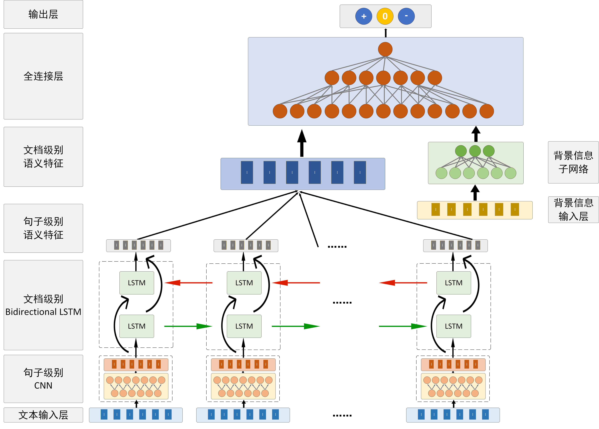
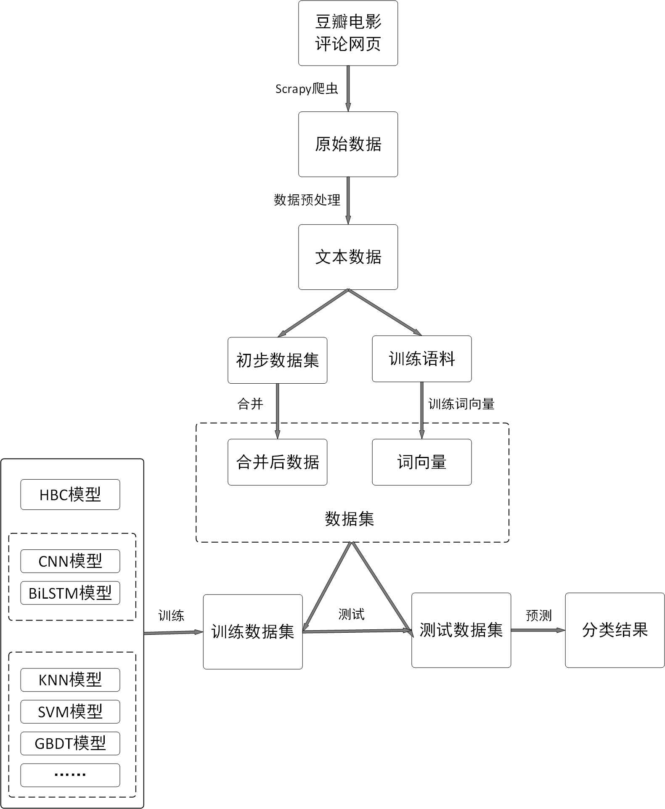

# Hierarchical BiLSTM CNN

----
# folders:

-scrapy_douban  
	
* 	crawl raw data from Douban using Scrapy  

-data  

* 	data to preprocess  

-models  

* 	proposed models and experiments  

----

### requirements:

1. keras  
1. tensorflow >1.0  
1. gensim  

----

# Models:

### 1. Hierarchical BiLSTM CNN

* 20个句子级别的CNN capture句子语义
* 一个BiLSTM capture整体文档语义
* 背景子网络MLP融合背景信息

### 2. baselines1: plain BiLSTM, CNN 

### 3. baselines2: machine learnings

including：

* Naive Bayers
* K-nn
* Logistic Regression
* Decision Tree
* Random Forest
* Gradient Boosting DT
* SVM

# scrapy_douban:

### 1. movies
	movie_id	casts	run_length	title	rate	directors

	26387939	阿米尔·汗;法缇玛·萨那·纱卡;桑亚·玛荷塔;阿帕尔夏克提·库拉那;沙克希·坦沃	161(印度)	摔跤吧！爸爸	9.1	涅提·蒂瓦里

### 2. reviews
	polarity	vote	movie_id	content	veto	stars

	-1	123	26683290	1 设定（交换，时空等）莫名其妙无缘由，到结尾也没什么解释。2 故事太简单，没有特别之处。3 故事的节奏忽快忽慢。4 画面美，景色赞。5 结尾拖拖拉拉不在重点。6 二次元小孩恋爱，有些低龄的设定。7 画面不够精细，很多场景有赶工嫌疑。8 用奇幻来弥补编剧上的短板并非上策。9 画面很多细节处理非常值得国内学习借鉴。10生活化的场景，地点，让人感觉亲切。11一些角色多余，如女同事。12后半部分故事编的太乱。13完全可以在一小时之内看完的故事，在各种风景特写中拖长。14故事中的感动点没有利用好，看到后面神秘感丧失殆尽。15画面上各种技术运用合理得当。16更像一部旅游宣传片，而不是动漫电影。17故事上有更大改善空间，离好故事还差很远。18中间部分有些情节拖拉。19看之前抱的希望太大，并未达到自己期待。20从本部电影可以看出中日国民素质差距还是比较大，日本生态环境文化历史保留都比中国好太多。21老套的未卜先知的故事。	174	1

# Datas:

### 1. movie reviews crawling from Douban long movie review document using Scrapy

### 2. texts preprocess

*  	drop dirty item
*  	word segmentation

### 3. training word embedding using Gensim.Word2vec

### 4. combining movies and reviews into one.

